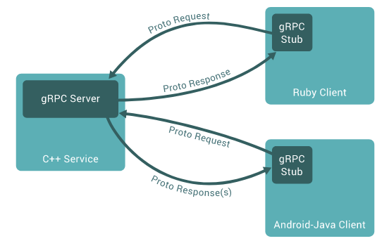
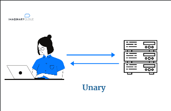
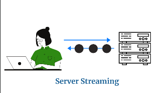
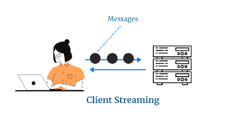
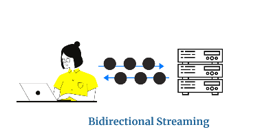

# In This Session

- Intro to gRPC
- How it works
- Protobuf
- Protoc
- Basic gRPC Server
- Basic gRPC Client
- Unary RPC
- Server streaming RPC
- Client streaming RPC
- Bidirectional streaming RPC 

# Intro to gRPC

- gRPC - Google remote procedure call
- Open source RPC initially developed at Google
- Uses HTTP 2.0 protocol
- Cross-platform client and server bindings for many languages
- Most commonly used for connecting services in microservies

# How it works

- Define a service interface, specifying the methods that can be called remotely with their parameters and return types.
- Server implements this interface and runs a gRPC server
- Client has a stub that can directly call a method on the server
- gRPC abstracts the http implementation



# Protobuf

- Interface description language
- Used for serializing data
- Used for defining a service interface 
- Defined in a proto file with extension *.proto*

```proto
syntax = "proto3"

message Request {
  string query = 1;
}

message Response {
  string result = 1;
}

service SearchService {
  rpc Search(Request) returns (Response);
}
```

# Protoc

- It is a protobuf complier
- Generates client and server code in a preferred language

```bash

protoc --cpp_out=DST_DIR --java_out=DST_DIR --python_out=DST_DIR path/to/file.proto

```

# gRPC Server

- Create a class/struct
- Implement the service interface methods created by protoc via this struct
- Use this struct to start the gRPC server

```go
// struct that implements the rpc service interface
type serachServer struct {
        ...
}
...

func (s *serachServer) Search(ctx context.Context, point *pb.Request) (*pb.Response, error) {
        ...
}
```

```go 
// starting a gRPC server
lis, err := net.Listen("tcp", fmt.Sprintf("localhost:%d", *port))
if err != nil {
  log.Fatalf("failed to listen: %v", err)
}
var opts []grpc.ServerOption

grpcServer := grpc.NewServer(opts...)
pb.RegisterSearchServer(grpcServer, &StructThatImplementedTheInterface) // pb is the pkg/file generated by protoc
grpcServer.Serve(lis)

```

# gRPC Client

- Create a stub to call the service methods by connecting to the server.
- Calling the method is simple as calling a local method

```go
var opts []grpc.DialOption

conn, err := grpc.Dial(*serverAddr, opts...) 
if err != nil {
  ...
}
defer conn.Close()

client := pb.NewSearchClient(conn)

result, err := client.Search(context.Background(), &pb.Request{"sample query"})
if err != nil {
  ...
}

```

# Unary RPC

-  When the client sends a single request and receives a single response



# Server Streaming RPC

- When the server responds with a stream of messages to a client's request. Once all the data is sent, the server additionally delivers a status message to complete the process
  


# Client Streaming RPC

- When the client sends a stream of messages and in turn receives a single response message from the server



# Bidirectional Streaming RPC 

- The two streams (client and server) are independent, meaning that they both can transmit messages in any order. The client is the one who initiates and ends the bidirectional streaming 



# THANK YOU
